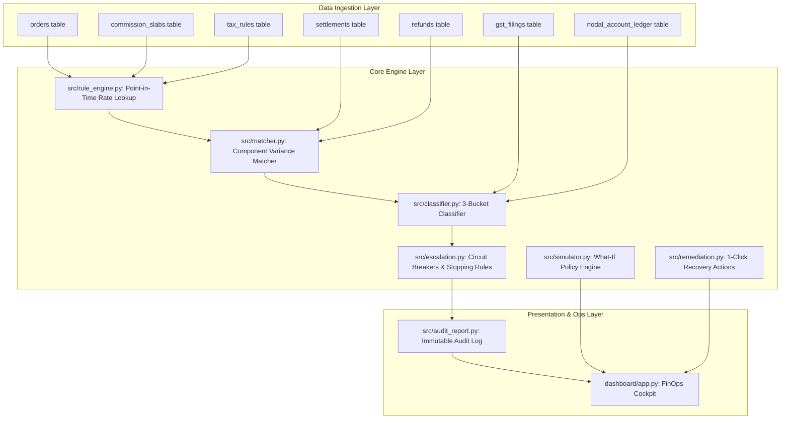

# Technical Architecture Specification: SplitGuard AI

## 1. System Philosophy & Objectives
SplitGuard AI is an autonomous, point-in-time reconciliation and escrow integrity engine designed for multi-vendor digital marketplaces and payment aggregators. It operates under strict regulatory constraints:
- **Section 52 CGST Act (1% TCS)**
- **Section 194-O Income Tax Act (0.75% / 1% TDS)**
- **RBI Nodal & Escrow Account Operational Directions**



---

## 2. Relational Database Schema (SQLite ACID)

```sql
PRAGMA foreign_keys = ON;

CREATE TABLE orders (
    order_id TEXT PRIMARY KEY,
    vendor_id TEXT NOT NULL,
    order_date TEXT NOT NULL,
    gross_amount REAL NOT NULL,
    category TEXT NOT NULL,
    is_split_eligible INTEGER NOT NULL CHECK (is_split_eligible IN (0, 1))
);

CREATE TABLE commission_slabs (
    vendor_id TEXT NOT NULL,
    effective_from TEXT NOT NULL,
    effective_to TEXT,
    rate REAL NOT NULL,
    PRIMARY KEY (vendor_id, effective_from)
);

CREATE TABLE tax_rules (
    rule_type TEXT NOT NULL,
    rate REAL NOT NULL,
    effective_from TEXT NOT NULL,
    effective_to TEXT,
    PRIMARY KEY (rule_type, effective_from)
);

CREATE TABLE settlements (
    settlement_id TEXT PRIMARY KEY,
    order_id TEXT NOT NULL,
    settlement_date TEXT NOT NULL,
    amount REAL NOT NULL,
    commission_deducted REAL NOT NULL,
    tcs_deducted REAL NOT NULL,
    tds_deducted REAL NOT NULL,
    logistics_deducted REAL NOT NULL,
    FOREIGN KEY (order_id) REFERENCES orders(order_id)
);

CREATE TABLE refunds (
    refund_id TEXT PRIMARY KEY,
    order_id TEXT NOT NULL,
    vendor_id TEXT NOT NULL,
    refund_amount REAL NOT NULL,
    refund_date TEXT NOT NULL,
    FOREIGN KEY (order_id) REFERENCES orders(order_id)
);

CREATE TABLE gst_filings (
    vendor_id TEXT NOT NULL,
    filing_month TEXT NOT NULL,
    filed_date TEXT,
    PRIMARY KEY (vendor_id, filing_month)
);

CREATE TABLE nodal_account_ledger (
    date TEXT PRIMARY KEY,
    opening_balance REAL NOT NULL,
    collected REAL NOT NULL,
    settled REAL NOT NULL,
    closing_balance REAL NOT NULL
);

CREATE TABLE exceptions (
    exception_id TEXT PRIMARY KEY,
    order_id TEXT,
    exception_type TEXT NOT NULL,
    reason TEXT NOT NULL,
    confidence_score REAL NOT NULL,
    status TEXT NOT NULL,
    rupee_impact REAL NOT NULL,
    created_at TEXT NOT NULL
);

CREATE TABLE audit_log (
    log_id INTEGER PRIMARY KEY AUTOINCREMENT,
    timestamp TEXT NOT NULL,
    stage TEXT NOT NULL,
    action TEXT NOT NULL,
    detail TEXT NOT NULL
);
```

---

## 3. Core Engine Pipeline Stages

### Stage 1: Point-in-Time Rate Reconstruction (`src/rule_engine.py`)
Computes the exact applicable commission and statutory tax rates active on the **order creation date**:
$$\text{effective\_from} \le \text{order\_date} \land (\text{effective\_to} \ge \text{order\_date} \lor \text{effective\_to IS NULL})$$

### Stage 2: Component Variance Matching (`src/matcher.py`)
Calculates the expected net vendor payout:
$$\text{Expected Payout} = \text{Gross} - (\text{Comm} + \text{TCS} + \text{TDS} + \text{Logistics} + \text{Refund})$$
$$\Delta = \text{Actual Payout} - \text{Expected Payout}$$

### Stage 3: 3-Bucket Classification & Dynamic Confidence (`src/classifier.py`)
Discrepancies are partitioned into three mutually exclusive categories:
- **`settlement-math`**: True monetary leakage (commission slab mismatches, asymmetric refund clawbacks).
- **`tax-timing`**: Timing lags due to monthly GSTR-8 portal filings (Self-Skepticism filter).
- **`structural/compliance`**: Marketplace split ineligibility or Nodal Escrow deficit breaks.

Confidence score is dynamically assigned:
$$\text{Confidence} = \min\left(1.0, \max\left(0.50, 0.60 + 3.0 \times \frac{|\Delta|}{\text{Gross}} + 0.12 \times \mathbb{I}_{\text{corroborated}}\right)\right)$$

### Stage 4: Stopping Rules & Circuit Breakers (`src/escalation.py`)
- $\text{type} = \text{structural/compliance} \implies \text{status} = \text{escalated}$
- $\text{Nodal Deficit Break} \implies \text{status} = \text{escalated} \land \text{HALT BATCH}$
- $\text{Confidence} < 0.70 \implies \text{status} = \text{needs-review}$
- $\text{High-Confidence Deterministic} \implies \text{status} = \text{auto-cleared}$

### Stage 5: Remediation & What-If Simulation (`src/remediation.py`, `src/simulator.py`)
- 1-click official Debit Note generation with tracking ID.
- Automated GSTR-8 tax synchronization queue.
- Emergency Nodal Escrow Freeze alerts for banking ops.
- Live What-If policy sliders calculating marketplace revenue and tax withholding shifts.
