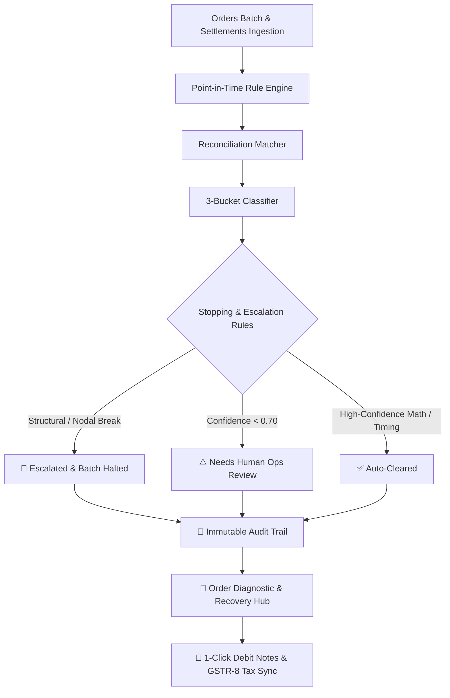

# SplitGuard AI — Autonomous Split-Settlement Reconciliation & Escrow Integrity Engine

[](https://www.python.org/downloads/)
[](https://streamlit.io/)
[]()
[]()
[]()

> **Razorpay AI Buildathon 2026**: Autonomous multi-vendor marketplace reconciliation agent closing the finance-ops loop across point-in-time commission lookups, refund clawback audits, GSTR-8 tax timing filters, and RBI nodal account escrow solvency checks.

---

## ⚡ Core Problem & Solution

Marketplace aggregators face multi-crore revenue leakages and regulatory vulnerabilities from four silent breakdown modes:
1. **Retroactive Commission Slab Drift**: Aggregators settling transactions with *current* month commission rates instead of the exact *point-in-time contract rate* active on order creation date.
2. **Asymmetric Refund Over-Clawbacks**: Aggregator systems clawing back full order amounts or wrong vendor shares on partial multi-vendor returns.
3. **False-Alarm Tax Timing Gaps (GSTR-8 Timing)**: Apparent TCS tax gaps that are simply timing differences pending monthly GSTR-8 portal filing, causing unnecessary vendor friction.
4. **Nodal Escrow Integrity Deficits**: Unexplained escrow deficits violating RBI Nodal Account Directions that must immediately halt automated payouts.

**SplitGuard AI** intercepts all split settlements, reconstructs point-in-time contracts, classifies discrepancies into 3 distinct buckets with dynamic Bayesian confidence scoring, and executes automated circuit-breaker stopping rules.

---

## 🏗️ Technical Architecture



### Classification Buckets
1. `settlement-math`: Real financial loss (commission slab errors, excessive refund clawbacks, rounding leaks).
2. `tax-timing`: Harmless timing variance pending GSTR-8 tax filing on the 10th of the following month (Self-Skepticism filter).
3. `structural/compliance`: Marketplace eligibility blocks or Nodal Account balance breaks.

---

## 🚀 Key Features

- **📊 Executive Analytics**: Visual risk radar with variance breakdown donut, vendor exposure bar chart, and 62-day RBI nodal account timeline.
- **🔍 Smart Exception Triage**: Filterable and searchable ledger ranked by ₹ financial impact.
- **🔬 Order Diagnostic & Recovery Hub**: Interactive line-by-line Financial Waterfall (`Gross → Comm → TCS → TDS → Logistics → Refund → Net Payout`) with 1-click official Debit Note generation.
- **🧮 Vendor 360° & What-If Policy Simulator**: Inspect vendor lifetime metrics and simulate portfolio-wide commission adjustments and Section 194-O TDS tax shifts in real-time.
- **📜 Regulatory Audit Trail**: Immutable timestamped pipeline trace with 1-click JSON Compliance Audit Certificate and CSV exports.

---

## 🛠️ Quick Start

```bash
# 1. Clone repository
git clone https://github.com/ParthKhandelwal537/split-settlement-leakage-detector.git
cd split-settlement-leakage-detector

# 2. Install dependencies
pip install -r requirements.txt

# 3. Run full automated test suite (14/14 tests)
pytest -v

# 4. Launch interactive dashboard
streamlit run dashboard/app.py
```

---

## 📂 Repository Structure

```
split-settlement-leakage-detector/
├── .streamlit/config.toml          # Dark theme & headless server configuration
├── data/
│   ├── reconciliation.db           # ACID SQLite database (9 relational tables)
│   └── seed_manifest.json          # Seed manifest test vectors
├── src/
│   ├── __init__.py
│   ├── rule_engine.py              # Point-in-time rate calculation engine
│   ├── matcher.py                  # Financial delta & component variance matcher
│   ├── classifier.py               # 3-bucket classifier with dynamic confidence scoring
│   ├── escalation.py               # Compliance stopping rules & circuit breakers
│   ├── simulator.py                # What-If policy & tax simulation engine
│   ├── remediation.py              # 1-click debit note & recovery actions
│   ├── data_generator.py           # Synthetic dataset seeder
│   ├── report.py                   # Metrics & reconciliation reporting
│   └── audit_report.py             # Regulatory audit log reader
├── tests/
│   ├── __init__.py
│   ├── test_rule_engine.py         # Rate calculation unit tests
│   ├── test_escalation.py          # Escalation & circuit breaker tests
│   ├── test_simulator.py           # Policy simulation tests
│   └── test_remediation.py         # Debit note & dispute action tests
├── dashboard/
│   └── app.py                      # Production Streamlit FinOps Dashboard
├── ARCHITECTURE.md                 # Deep technical architecture specification
├── SPEC.md                         # Business logic & domain requirements
├── requirements.txt                # Python runtime dependencies
└── README.md
```

---

## 🧪 Verification & Test Suite

All 14 automated unit and integration tests pass:
```
tests/test_escalation.py::test_nodal_balance_always_escalated PASSED
tests/test_escalation.py::test_structural_compliance_exceptions_escalated PASSED
tests/test_escalation.py::test_status_breakdown_consistency PASSED
tests/test_remediation.py::test_generate_debit_note PASSED
tests/test_remediation.py::test_schedule_gstr8_sync PASSED
tests/test_remediation.py::test_trigger_escrow_freeze PASSED
tests/test_remediation.py::test_update_dispute_status PASSED
tests/test_rule_engine.py::test_retroactive_commission_slab_change PASSED
tests/test_rule_engine.py::test_tax_rate_transition PASSED
tests/test_rule_engine.py::test_tcs_rule_consistency PASSED
tests/test_rule_engine.py::test_other_vendors PASSED
tests/test_simulator.py::test_simulator_zero_delta PASSED
tests/test_simulator.py::test_simulator_positive_commission_shift PASSED
tests/test_simulator.py::test_simulator_tds_variation PASSED

============================= 14 passed in 1.62s ==============================
```
